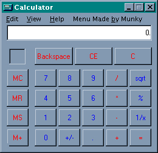



## ADD A MENU TO ANY PROGRAM IN ONLY 6 LINES OF CODING\!\!\!\!

### Description

This actually Adds a menu to any program! AOL, AIM, Notepad, you name it! This code also enables you to add sub menu's to the menu you want to create!!! DOWNLOAD THIS NOW, please vote!

E-Mail: itzmunky@hotmail.com

Screen name: itbemunky
 
### More Info
 

             |
---                |---
**Submitted On**   |2001-07-14 18:53:14
**By**             |[Munky](https://github.com/Planet-Source-Code/PSCIndex/blob/master/ByAuthor/munky.md)
**Level**          |Beginner
**User Rating**    |4.6 (83 globes from 18 users)
**Compatibility**  |VB 4\.0 \(16\-bit\), VB 4\.0 \(32\-bit\), VB 5\.0, VB 6\.0
**Category**       |[Miscellaneous](https://github.com/Planet-Source-Code/PSCIndex/blob/master/ByCategory/miscellaneous__1-1.md)
**World**          |[Visual Basic](https://github.com/Planet-Source-Code/PSCIndex/blob/master/ByWorld/visual-basic.md)
**Archive File**   |[ADD A MENU227917142001\.zip](https://github.com/Planet-Source-Code/munky-add-a-menu-to-any-program-in-only-6-lines-of-coding__1-25025/archive/master.zip)

